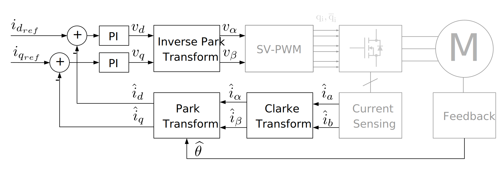

Current Loop
============

The current control loop is the component responsible of controlling the
inverter input by providing the control signals in the :math:`\alpha,\beta`
space. These are used by the SV-PWM driver to generate the PWM signals as well
as adjust the current sampling time. The current loop makes use of the estimated phase
currents, :math:`\hat{i}_a,~\hat{i}_b`, and the estimated electrical angle,
:math:`\hat{\theta}` to apply the principles of Field Oriented Control (FOC).
:numref:`cloop-schematic` shows a block diagram that illustrates how all the
components are connected.

.. _cloop-schematic:

   Current loop (highlighted blocks)

API
---

.. doxygengroup:: spinner_lib_control_cloop
